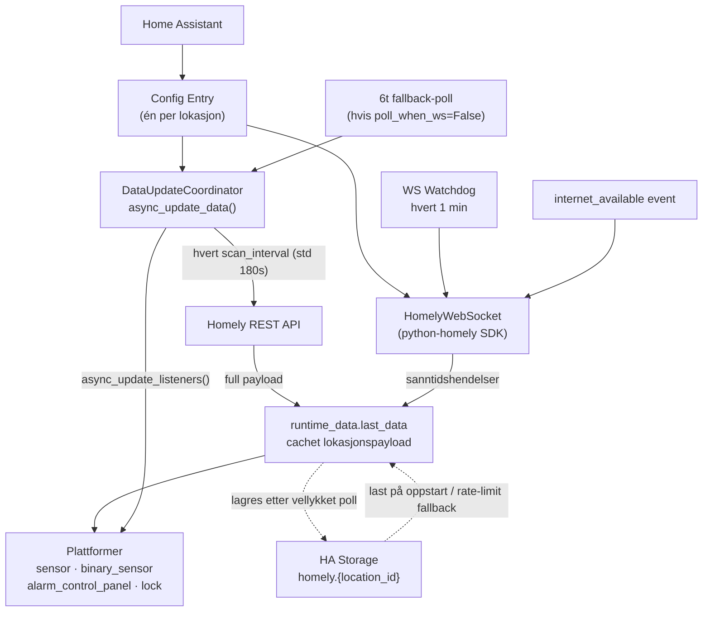
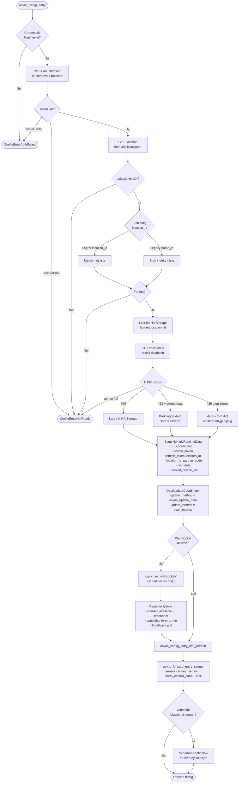
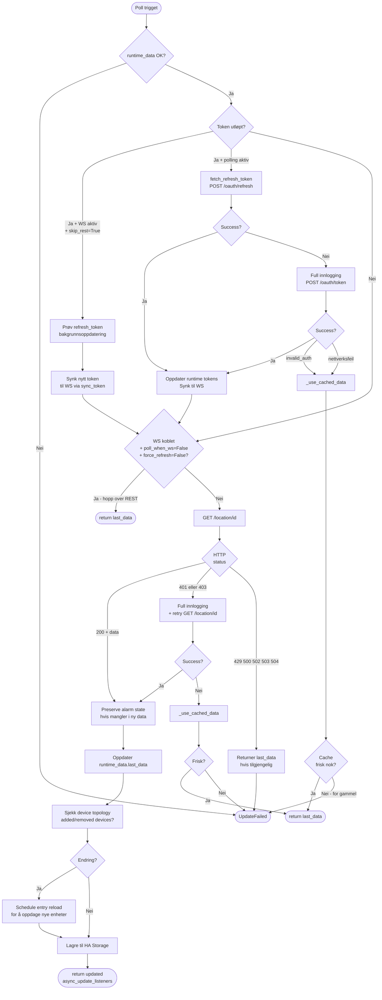
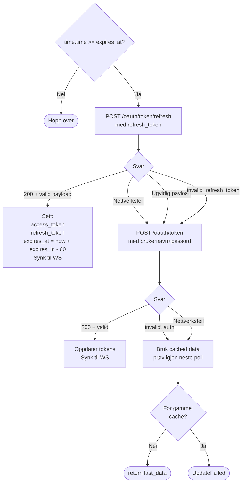
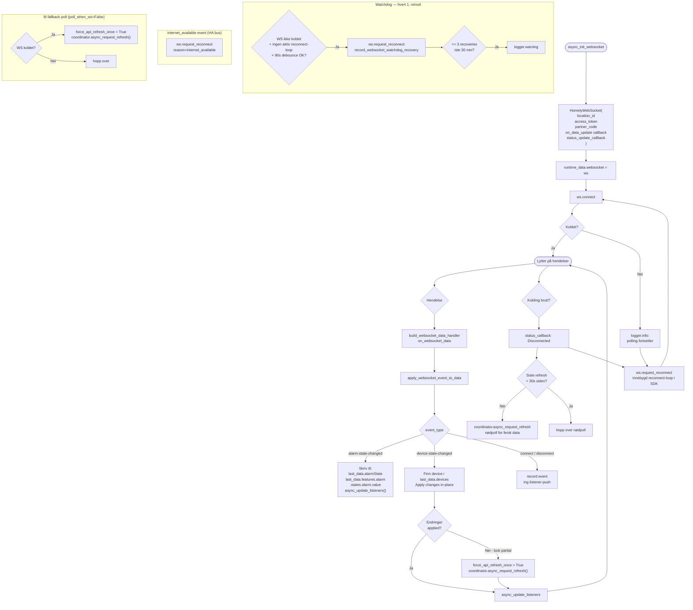
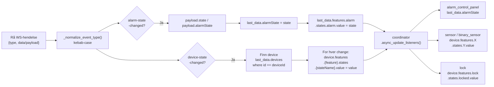
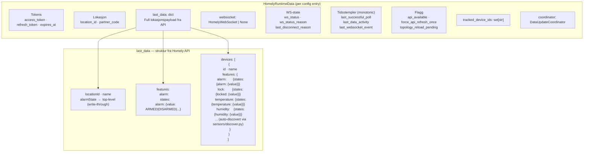
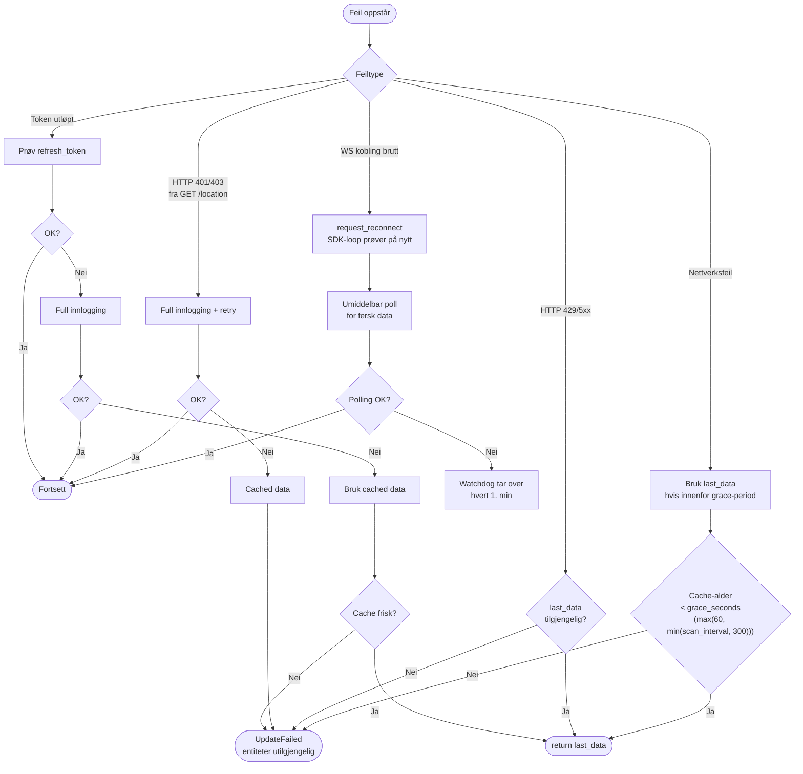

# Homely Integration — Architecture

> Beste visning: GitHub, VS Code + Mermaid Preview, eller Obsidian.

---

## 1. Systemoversikt

---

## 2. Oppstart (async_setup_entry)

---

## 3. Poll-syklusen (coordinator async_update_data)

---

## 4. Token-refresh beslutningstre

---

## 5. WebSocket-livssyklus

---

## 6. WS-hendelse → cache → entiteter

**Alarmtilstand etter omstart:** WS sender bare *endringer* (ingen initiell snapshot), men
`alarmState` persisteres til `Store` (`.storage/homely.{location_id}`) hver gang en
`alarm-state-changed` skrives. Ved oppstart laster setup denne lagrede `last_data`, så
`HomelyAlarmPanel.alarm_state` viser **siste kjente status med en gang**. Den er bare `unknown`
ved aller første oppsett uten lagret data — da fylles den på første `alarm-state-changed`.
Endres alarmen mens HA er av, vises gammel verdi til neste event korrigerer den. Verdien må
finnes i `STATE_MAP` (`DISARMED`, `ARMED_*`, `*_PENDING`, `TRIGGERED`, `BREACHED`), ellers blir
den `unknown` og logges som `Unknown alarm state from API`.

---

## 6b. WebSocket-only modus (REST-polling nede)

**Bakgrunn (hvorfor):** Homelys `/home/{locationId}`-endepunkt er for tiden ødelagt — det
svarer med HTTP **439** i stedet for lokasjonspayloaden. Dette endepunktet er eneste kilde til
full enhets-/batteritilstand, så mens det er nede kan vi ikke polle for det. `439` er ikke en
standard HTTP-kode og ligger ikke i `_TRANSIENT_HTTP_STATUS` (`{429, 500, 502, 503, 504}`), så
den behandles som en vanlig poll-feil → cached data / WS-only i stedet for retry. WS leverer
fortsatt live endringer (`alarm-state-changed`, `device-state-changed`), så integrasjonen kjører
videre på WS alene fremfor å dø helt.

Når `/home`-pollen feiler men WS er tilkoblet kjører integrasjonen videre på WS alene
(`runtime_data.api_available = False`). Entiteter som bare lever på polldata skal da ikke
vise stale/falske verdier:

- **Live update connection status** (`HomelyWebSocketStatusSensor`): `available` er alltid
  `True` (rapporterer WS-helse uavhengig av poll) og er nå `entity_registry_enabled_default = True`,
  så den er synlig som standard.
- **Battery problem** (`HomelyAllBatteriesHealthySensor`): batteridata bæres kun av REST-pollen,
  så `available` gates på `api_available` via `api_available_getter`. Når polling er nede blir den
  *utilgjengelig* i stedet for å rapportere falsk «all healthy». Per-enhet batterisensorer blir
  ikke opprettet uten polldata (tom `{}`-seed → ingen `devices`).

---

## 7. Datamodell (HomelyRuntimeData)

---

## 8. Feilhåndtering og fallback-hierarki

